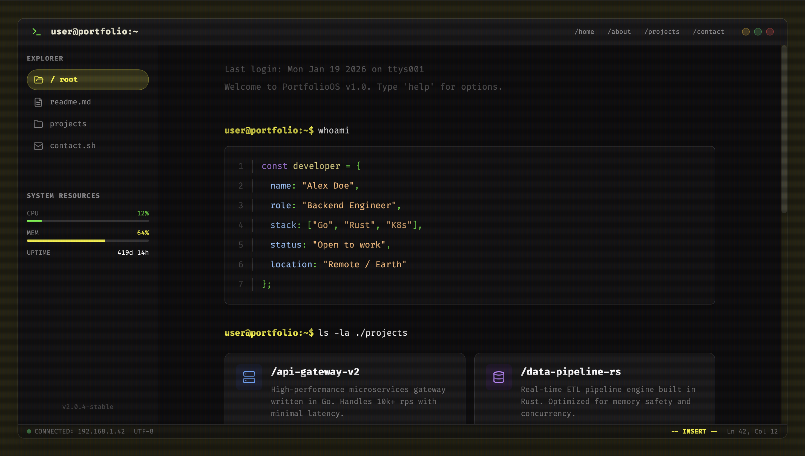

# PortfolioOS

<div align="center">
  
  
  <br />

  
  
  
  
 
</div>

<br />

## ⚡ About The Project
PortfolioOS is an immersive personal portfolio website designed to mimic a retro terminal operating system. It features a fully interactive command-line interface where users can execute commands to navigate projects, view system statistics, and contact the developer. Built with modern web technologies, it combines nostalgic aesthetics with a smooth, responsive user experience.

## ✨ Key Features
* 🎯 **Terminal Interface :** An authentic command-line environment with typing effects, command history, and interactive prompts.
* 🚀 **System Monitoring :** Real-time visualization of simulated system resources like CPU usage, memory allocation, and uptime.
* 🎨 **Interactive Scripts :** Execute custom scripts like `contact.sh` for messaging and browse files through a virtual file system.

## 🛠️ Built With
* **Front-end :** React, TypeScript, Vite, Tailwind CSS, Lucide React
* **Back-end :** None (Client-side implementation)

## 🚀 Getting Started
```bash
# Clone the repo
git clone https://github.com/Mid0o03/portfolio_user

# Install dependencies
npm install

# Run the server
npm run dev
```
